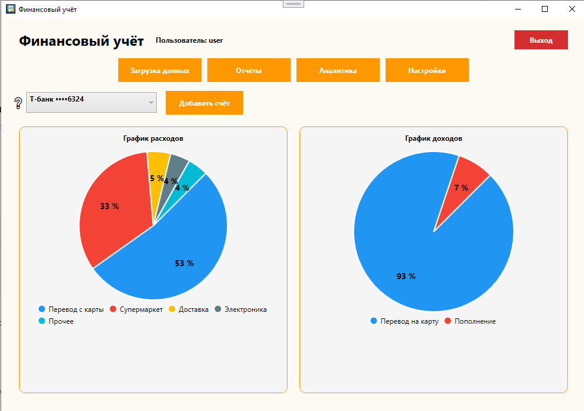

# Система анализа банковских транзакций

---

## Аннотация

Данный программный продукт представляет собой десктопное приложение для загрузки банковских выписок,
их унификации, автоматической категоризации транзакций и визуализации финансовых данных.
Программа предназначена для анализа доходов и расходов пользователей на основе файлов выписок.

---

## Введение

### Основные возможности

- Загрузка банковских выписок (CSV, XLSX, PDF)
- Унификация данных из разных банков
- Автоматическая категоризация транзакций
- Визуализация доходов и расходов
- Формирование и экспорт отчетов

---

## Назначение и условия применения

Программа предназначена для использования физическими лицами и индивидуальными предпринимателями.
Эксплуатация осуществляется на персональном компьютере под управлением Windows 10/11.
Для работы требуется установленная платформа .NET и сервер базы данных PostgreSQL.

---

## Установка

### Шаги установки

1. Склонировать репозиторий
2. Установить необходимые зависимости
3. Настроить параметры подключения

#### Чек-лист установки

- [x] Установлен .NET Runtime  
- [x] Установлен PostgreSQL  
- [ ] Запущен ML-сервис  
- [ ] Проверено подключение к БД  

---

## Описание операций

### Загрузка банковской выписки

Пользователь выбирает файл выписки, после чего данные отображаются в таблице.

```csharp
// Пример обработки загруженной выписки
   ObservableCollection<TransactionRecord> transactions = new ObservableCollection<TransactionRecord>();

   rawText = rawText.Replace('\u00A0', ' ');

   int idx = rawText.IndexOf("Расшифровка операций");
   if (idx >= 0)
       rawText = rawText.Substring(idx);       
       string[] records = Regex.Split(rawText, @"(?=\d{2}\.\d{2}\.\d{4})")
                             .Where(r => !string.IsNullOrWhiteSpace(r))
                             .Select(r => r.Trim())
                             .ToArray();

   for (int i = 0; i < records.Length; i++)
   {
       string record = records[i];             
       string date = record.Substring(0, 10).Trim();
       string headerPart = record.Substring(21).Trim();

       var mAmount = Regex.Match(headerPart, @"[+\-]?\d{1,3}(?:[ ]\d{3})*,\d{2}");
       if (mAmount.Success)
       {
           int amountIndex = mAmount.Index;
           string category = headerPart.Substring(0, amountIndex).Trim();
           string amount = mAmount.Value.Trim();
           if(!amount.StartsWith("+") && !amount.StartsWith("-"))
               amount = "-" + amount;
           string afterAmount = headerPart.Substring(amountIndex + mAmount.Length).Trim();
           var mBalance = Regex.Match(afterAmount, @"\d{1,3}(?:[ ]\d{3})*,\d{2}");
           if (mBalance.Success)
           {                       
               string balance = mBalance.Value.Trim();
               transactions.Add(new TransactionRecord
               {
                   Date = date,
                   Category = category,
                   Amount = amount,
                   Balance = balance,
                   Type = amount.StartsWith("+") ? "Income" : "Expense",
                   Description = ""
               });
           }
       }
```
Пример интерфейса




Термины и сокращения
Термин	Описание
ML	Машинное обучение
API	Интерфейс программного взаимодействия
CSV	Формат табличных данных
PDF	Формат электронных документов

Цитата
Финансовый анализ — это основа принятия решений.

Автоматизация делает его доступным каждому.

Контакты
Связаться с автором:
Telegram

Справочная информация
Версия: 1.0
Дата: 2025 г.
